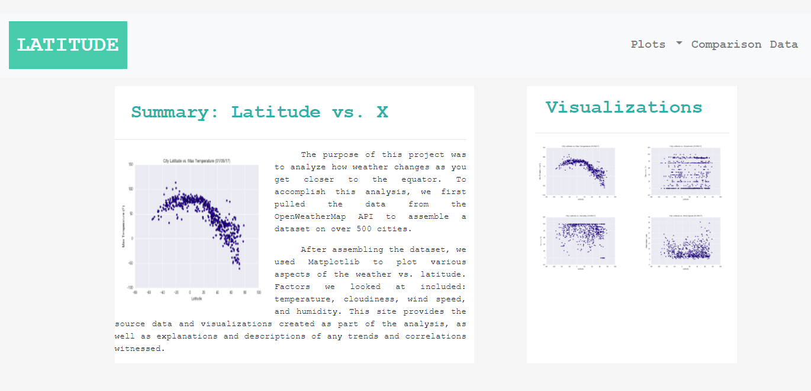
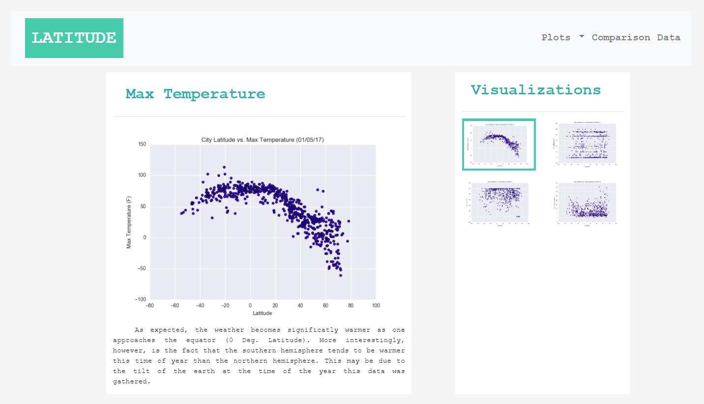
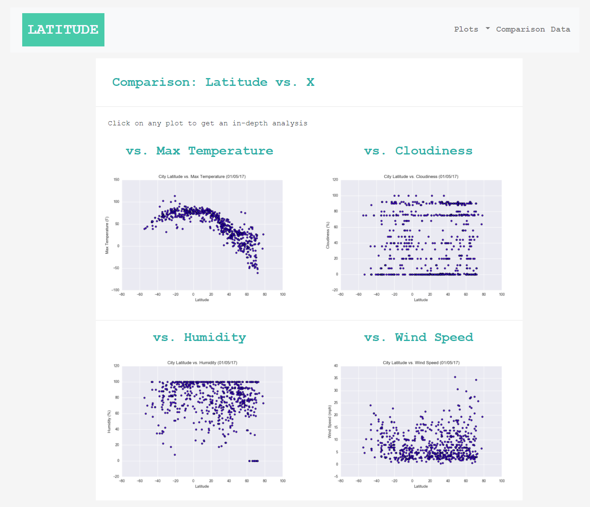
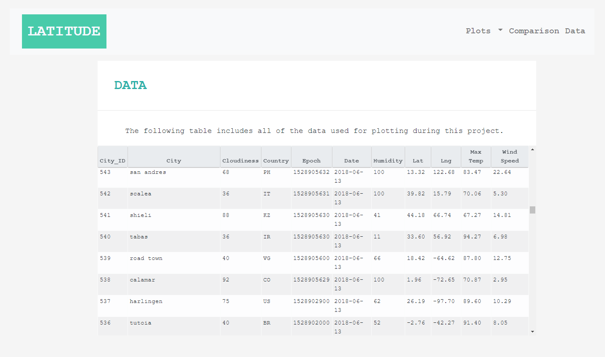

 <h2 align="center"> Web Design Challenge </h2>
 <h1 align="center"> Interactive Dashboard </h1>

<!-- TABLE OF CONTENTS -->

  
Table of Contents

  <ol>
    <li>
      <a href="#background">Background</a>
      <ul>
        <li><a href="#built-with">Built With</a></li>
      </ul>
    </li>
    <li>
      <a href="#landing-page">Landing Page</a>
    </li>
    <li>
      <a href="#visualization-page">Visualization Page</a>
    </li>
    <li>
      <a href="#comparisons-page">Comparisons Page</a>
    </li>
    <li>
      <a href="#data-page">Data Page</a>
    </li>
    <li>
      <a href="#summary">Summary</a>
    </li>
  </ol>

<!-- Background -->
## Background
Using HTML, CSS, and Bootstrap, this project aims to develop an interactive visualization dashboard website deployed on GitHub Pages. The visualization is built on an earlier project, [Python API Challenge](https://github.com/asmvm/Python_API_Challenge), an anlysis of weather conditions of 500+ cities across the world of varying distance from the equator. This project was completed to fulfill Georgia Tech's Data Science and Analytics certificate.

### Built With
* [Bootstrap](https://getbootstrap.com/)
* HTML
* CSS

## Landing Page

The [landing page](https://asmvm.github.io/Web_Design_Challenge/WebVisualizations/weather_dashboard_index.html) provides a background of the project and an interactive menu to navigate to all visualizations and data. Thumbnails to each visualization page analyzing humidity, windspeed, max temperature, and cloudiness vs latitude is providede on the landing page.  

## Visualization Page
A visualization page is designed for each scatter plot, including a description of the plot and significance of the data. Select any of the links below to view the source html code or navigate to the plots from the "Plots" dropdown menu in the [landing page](https://asmvm.github.io/Web_Design_Challenge/WebVisualizations/weather_dashboard_index.html).

* [Max Temperture vs Latitude](https://github.com/asmvm/Web_Design_Challenge/blob/master/WebVisualizations/maxtemp.html)
* [Humidity vs Latitude](https://github.com/asmvm/Web_Design_Challenge/blob/master/WebVisualizations/humidity.html)
* [Cloudiness vs Latitude](https://github.com/asmvm/Web_Design_Challenge/blob/master/WebVisualizations/cloudiness.html)
* [Wind Speed vs Latitude](https://github.com/asmvm/Web_Design_Challenge/blob/master/WebVisualizations/windspeed.html)

## Comparisons Page
Scatter plots illustrating relationship between temperature, humidity, cloudiness, and windspeed vs latitude. Select link below to view HTML code or visit the [Comparisons Page](https://asmvm.github.io/Web_Design_Challenge/WebVisualizations/comparisons.html) to experience interactive design.

* [Comparisons page HTML code](WebVisualizations/comparisons.html)

## Data Page
The data page displays a responsive table containing the data used in the visualizations for 500+ cities around the world. To view HTML code, select the link below. To view the interactive table, visit the [Data Page](https://asmvm.github.io/Web_Design_Challenge/WebVisualizations/comparisons.html).

* [Data Page HTML code](saved_images/data.PNG)

## Summary

We successfully created a web visualization dashboard using HTML, Bootstrap, and a bit of CSS for clean design, organized layout, and interactive features that allow the user to navigate the site smoothly. The data represented in the visualizations is based off data collected in a previous Boot Camp project, [Python API Challenge](https://github.com/asmvm/Python_API_Challenge).

Among many of the challenges met for this project, key elements include using the Bootstrap grid for responsiveness, incorporating CSS media query for the navigation menu, designing the website to work at all window widths and sizes, and applying a navbar component for the header on every page. I hope you enjoyed gaining a better understanding on the how this interactive web visualization dashboard was created. 

